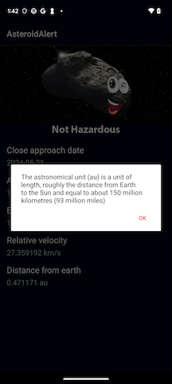

# AsteroidAlert App

## Getting Started

You should be able to run this app from within Android Studio using Android Gradle Plugin version 8.4.0, Gradle version 8.6,
and Java version 17

### Dependencies

This project uses the following dependencies:
- AndroidX core
- AndroidX appcompat
- AndroidX activity
- AndroidX constraintLayout
- Google Material
- AndroidX navigation (fragment, ui)
- AndroidX lifecycle (runtime, viewmodel)
- Retrofit2 (retrofit, moshi, scalars, corouines-adapter)
- Moshi (moshi, kotlin)
- Room (runtime, ktx, compiler)
- Glide & Picasse
- WorkManager

## Project Instructions

Running this project will launch the Main Screen. This screen contains a downloaded "Astronomy Picture of the Day" as well as a downloaded list of Near Earth Objects, both from Nasa's
Open APIs. The overflow menu has four options: 1) find out more information about the picture of the day 2) filter the list below to only those NEOs whose close approach date are remaining in this week (defined as Sunday through Saturday)
3) filter the list below to only those NEOs whose close approach data are today's date and 4) filter the list below to those NEOs that are saved in the database.

The RecyclerView holds a scrolling list of NEOs (Code Name & Close Approach Date) along with an icon that indicates whether the NEO poses a danger or not. Each item is clickable and will navigate the user to the detail screen for that NEO.
When rotated, the layout changes so that the image and the scrolling list are visible and functional.

The Detail Screen contains an dynamic image that changes according to whether the NEO poses a danger or not. Under the image is a list of NEO attributes that are extracted from the downloaded JSON object including Close Approach Date, 
Absolute Magnitude, Estimated Diameter, Relative Velocity, and Distance from Earth. Lastly there is a help icon that, when clicked, launches a dialog that explains the Astronomical Units that are used to indicate the distance 
the NEO is from Earth.

